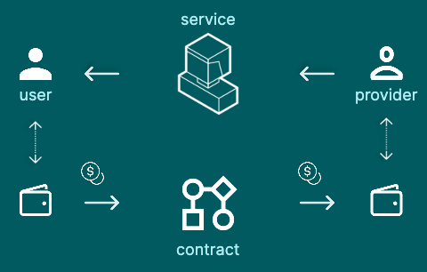
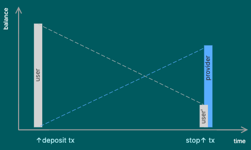

# BCA Market for Tokenized Services

#### Version: 2024-11-23
#### Copyright: 2024 Alexander Diemand
#### [License](./LICENSE): GPLv3 - GNU GENERAL PUBLIC LICENSE Version 3

## Documentation

[see documentation](./doc/README.md)

## Overview

We are developing the tokenization of services and have them managed on a blockchain with smart contracts.

The contracts' behaviour is defined by a fixed set of parameters.

Our product creates a market for tokenized services and brings users and service providers together.

## Principles & Ideas

- micropayments in a stable-coin (EUR, USD)
- alternative: ERC20 token pegged to a currency, on/off-ramp from/to fiat
- users keep their funds in their wallets, and only commit a small amount in deposits to the service contract
- optionally, users can subscribe to a bot that deposits every 24 hours the required funds to keep services running
- at any time either the user or the provider can call stop() and the contract halts
- at any time both the user and the provider can withdraw funds from the service contract: up to the calculated balance at the current block time
- the contracts store the necessary information and thus no party relies on a centralized backend for operations

## Micropayments and balance calculation

The service contract is created with a set of parameters which are fixed for the lifetime of the contract.

The calculation of the user's and provider's balances depend on the contracts start time and the current time, taken from the latest block.

Once the user makes her first deposit, the contract starts. Multiple deposits can be made by the user. And, both parties can withdraw up to their calculated balance.

## Solidity contracts and testing

see [README](./bca-token-solidity/README.md) in directory [./bca-token-solidity](./bca-token-solidity/)

## Frontend to interact with service contracts

Both users and providers connect to this user interface to interact with the service contracts.

see [README](./bca-token-market/README.md) in directory [./bca-token-market](./bca-token-market/)

## Frontend for minting/burning of tokens

Developping and testing is done using our own ERC20 token that mimics a stable-coin.

see [README](./bca-token-app/README.md) in directory [./bca-token-app](./bca-token-app/)
