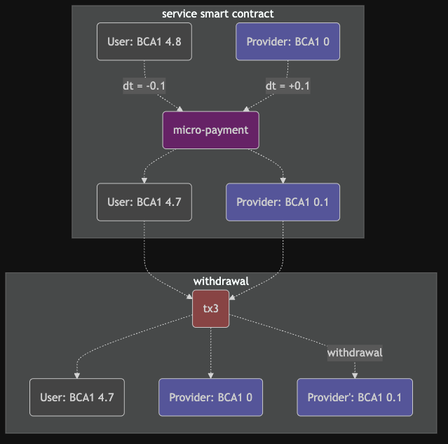

# Flow of transactions

A combination of off-chain and on-chain transactions define the interaction of the client with the system.

* a fiat on-ramp sells service tokens in the sense of a gift card to the client who's on-chain account will be credited with the corresponding amount
  * alternative: accepting crypto currencies might trigger the same
* the client exposes a fraction of her balance to the service
  * this is an on-chain transaction of transferring tokens from a client's account back to the service account
  * in return the client is credited with internal service tokens (GEEZ)
* the client starts and uses services
  * which then debit their usage from the client's GEEZ account

This approach has some

### CONS
- it is a bit laborous for the client
  - fiat payment, then on-chain transfer of tokens
- there are some parts which depend on "trust" like the account of GEEZ which is presumably held in an internal and opaque database

### PROS
- only a fraction of the client's holding are at stake, the rest is kept in an on-chain account
- a fiat on-ramp process allows more users to use the system
  - not everybody can, wants, or is allowed to use cryptocurrencies
- low transaction fees
  - fiat on-ramp: \<5% charged to the service
  - on-chain transfer: $0.05 or lower charged to the client

## Transactions

Let's have a closer look at the transactions involved.

### The client buys service tokens using fiat and gets credited

The client buys in a conventional fiat transaction some tokens. This is reflected by minting new tokens to the client's on-chain account.

### The client charges her account

Using an on-chain transaction, the client transfers a number of tokens to the _serviceAccount_.

This is reflected in crediting the client's off-chain account with "Geez" tokens of the same amount. 

### Services debit the client's account for micropayments

In an off-chain setup, or on a private blockchain with minimal transaction fees, services can debit client accounts for their service usage.

This is immediately reflected in an updated balance in the client's account.

