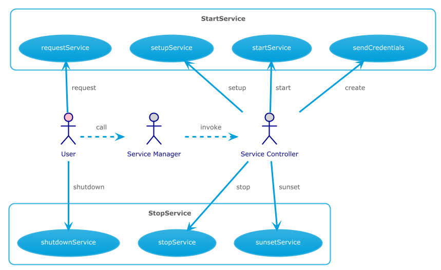
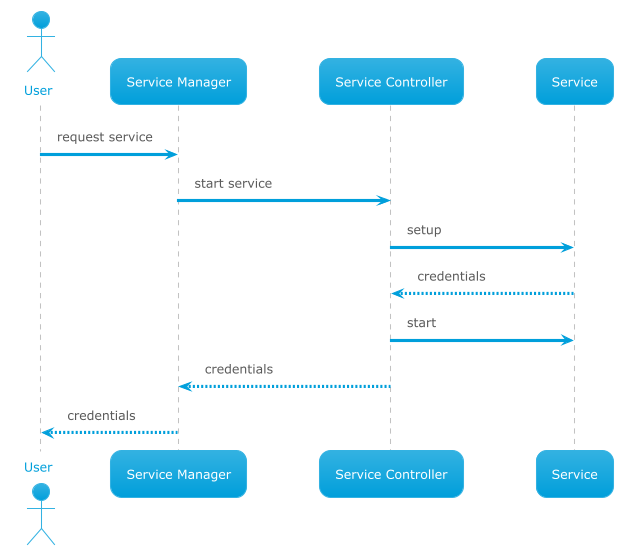
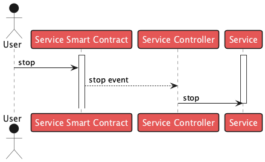
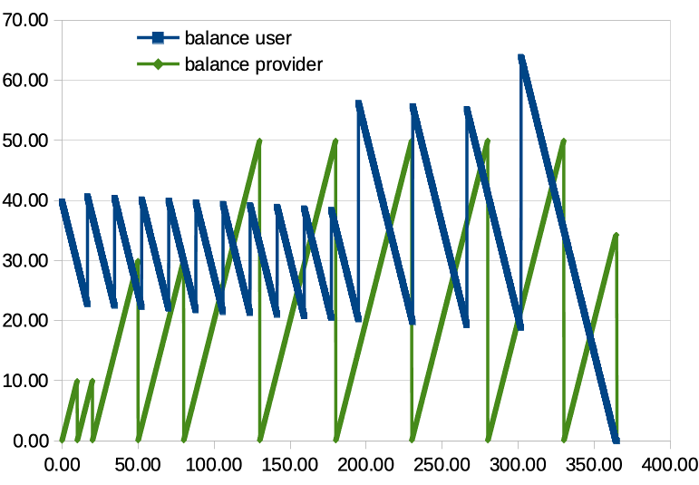
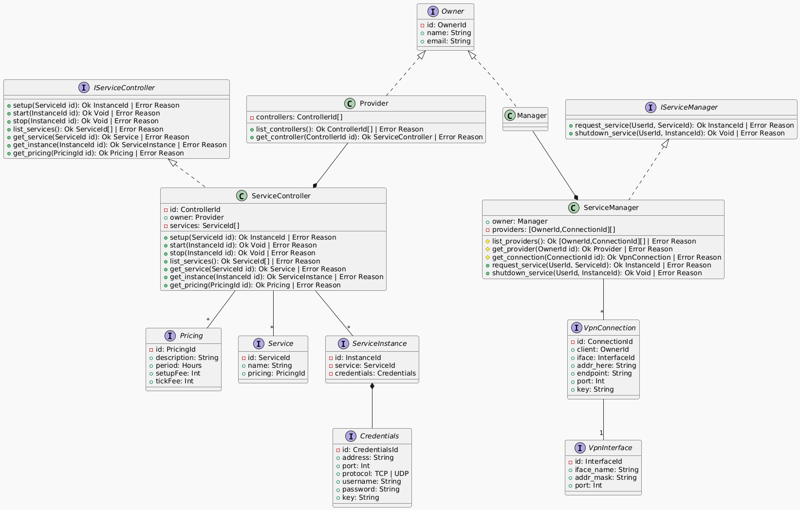

# Service Management

Contract [Solidity](../bca-token-solidity/contracts/BCA_Service.sol) code

There are three parties involved:
- the service account that owns the contract
- the user who requests and funds the service
- the service provider which provides services and manages them
  - represented by the service controller which reacts to events of the contract

## Setting up a new service instance

The user requests a new service with the service manager.

The service manager invokes the setup process with the service provider and deploys a new smart contract for this service instance.

To progress in the setup, the user must first deposit enough funds in the contract.

After the setup process ends successfully, the service provider hands over, in a secure way, the access credentials to the user via the service manager.

## Stopping a service

The user requests a subscribed service to be shutdown with a call to the "stop" method of the contract. Or, the user's deposit on the contract is exhausted.

The service controller reacts to the Stop event and invokes the shutdown process of the service.

## Billing of services

The contract is effectively calculating the user's and the provider's balances on arrival of a transaction.

Since the parameters of the contract are known, these balances can also be deterministically calculated off-chain.

This has the same effect as micro-payments. Users only pay for their usage and service providers earn a revenue stream. If the calculated balance is reasonably high, then a provider might withdraw their balance.

A service is in use after it has been started with a first deposit by the user. The usage ends with the stopping of the service, or if the user's balance runs out of funds.

At start of a service an initial setup fee can be charged. This fee also includes a potential tear down fee when the service is shut down; there is no extra fee due when the servicing ends.

### Contract simulation

The [spreadsheet](./img/Tokenized_Service_Contract_Simulation.ods) contains simulations for a short lived and a long-running service contract and the calculation of the user's and the provider's balances.

This shows the balances of the user and the provider over the lifespan of the service contract. The user regularly deposits coins to fund the service. Also, the provider withdraws funds as soon as they reach a certain amount.

## Registering a service controller

The service manager is part of this project and runs on our side.

The service controller runs on the service provider's infrastructure.

Between the two there is a secure VPN connection installed such that either party is assured to only communicate with the other and nobody else is listening.

