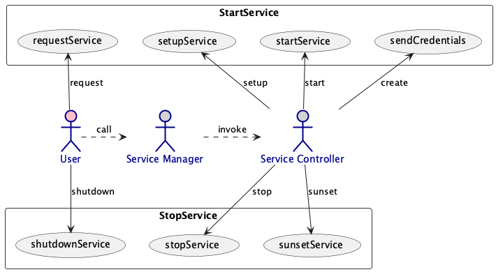
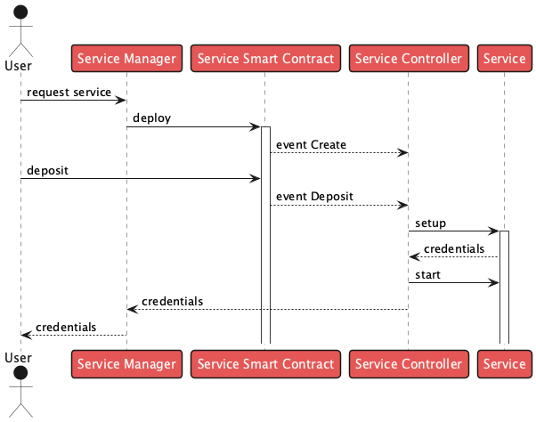
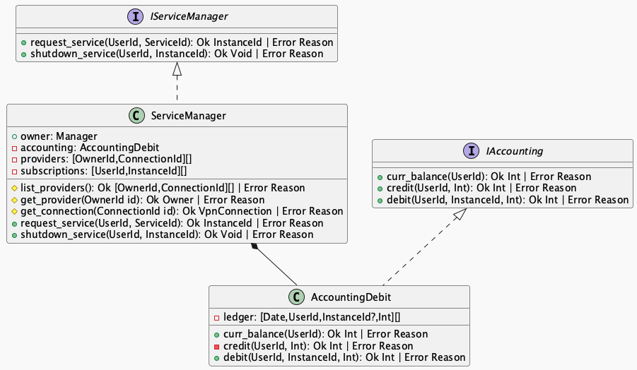

# Service Management

There are three parties involved:
- the user which initiates the requests
- the service manager which manages the user's account and communicates with both the user and the service providers
- the service provider which provides services and manages them

## Starting a service

The user requests a new service with the service manager.

The service manager invokes the setup process with the service provider.

After the process ends successfully, the service providers hands over the credentials in a secure way to the user via the service manager.

At this time, the user can use the service.

## Stopping a service

The user requests a service he has subscribed to be shutdown.

The service manager invokes the shutdown process with the service provider.

At the end of the process, the service provider acknowledges the sunsetting of the service and send this via the service manager to the user.

## Billing of services

The service manager debits the user's account periodically for the services in use.

The time periods of a tick are per hour: from one up to 24 hours.

A service is in use after it has been started. The usage ends with the stopping of the service.
If the user's account runs out of credits, then the service is stopped immediately and the usage ends.

At start of a service an initial setup fee can be charged. This fee also includes a potential tear down fee when the service is shut down; there is no extra fee due when the servicing ends.

At the end of the time period, the user's account is charged.

### Process of billing 

### Details of the accounting class

## Registering a service controller

The service manager is part of this project and runs on our side.

The service controller runs on the service provider's infrastructure.

Between the two there is a secure VPN connection installed such that either party is assured to only communicate with the other and nobody else is listening.

