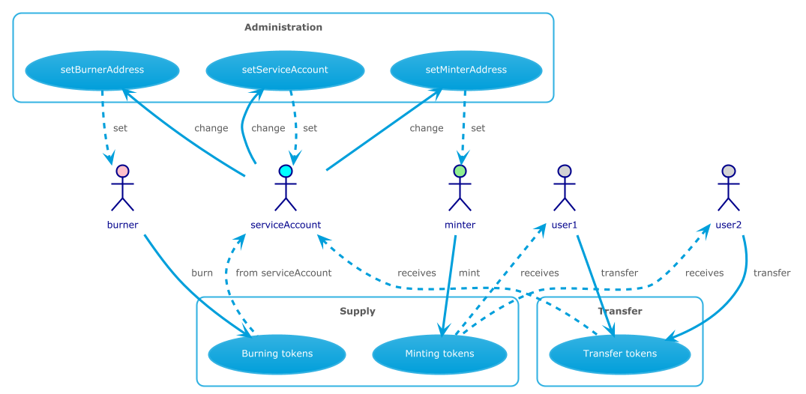

# Service Tokenization

## ERC20 Service Contract

Contract [Solidity](../bca-token-solidity/contracts/BCA_ERC20_nf.sol) code

### public methods
The ERC20 contract allows the following methods:

- totalSupply
- transfer

### administration methods
These methods can only be called from the _serviceAccount_

- setServiceAddress
- setMinterAddress
- setBurnerAddress

### supply methods

- mint
> only allowed from the _minter_ account

- burn
> only allowed from the _burner_ account

> will burn tokens in the _serviceAccount_

